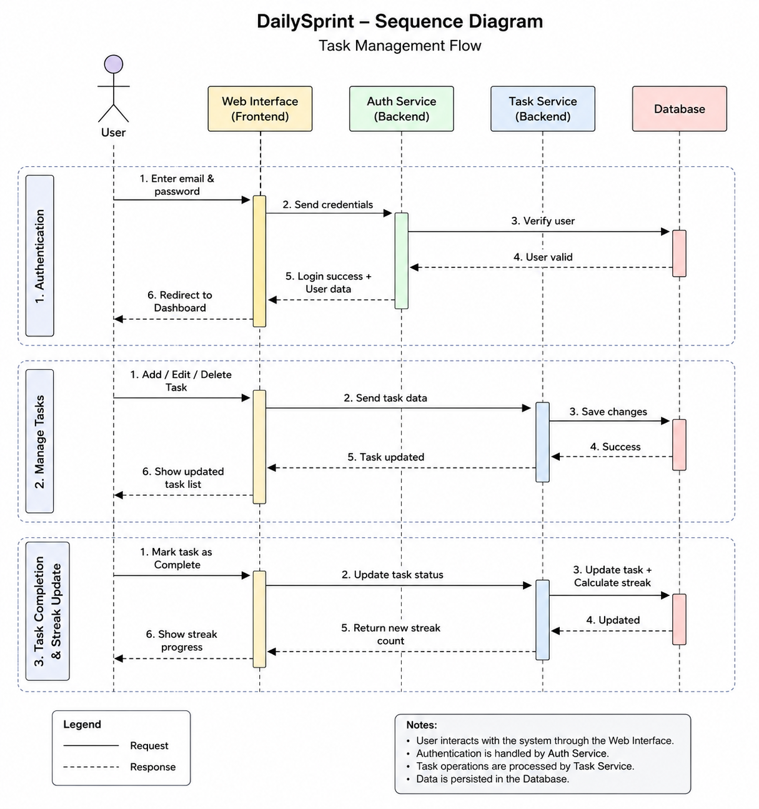

# DailySprint 🚀

A modern and minimal **Task Management Web Application** focused on productivity, consistency, and habit-building through task streaks and clean workflow management.
DailySprint helps users organize tasks, maintain productivity streaks, and stay focused with a distraction-free interface. 

---

## ✨ Features

* 🔐 User Authentication (Login & Registration)
* 📋 Task Management System
* 🔥 Productivity Streak Tracking
* 🎨 Modern Minimal UI Design
* 📱 Fully Responsive Layout
* ⚡ Smooth User Experience
* 🌙 Clean Typography & Animated Background Elements
* 🧩 Modular Frontend Structure

---

## 🛠️ Tech Stack

### Frontend

* HTML5
* CSS3
* JavaScript

### Fonts & UI

* Google Fonts

  * Syne
  * DM Sans

### Design Concepts

* Glassmorphism-inspired UI
* Minimal productivity dashboard aesthetics
* Responsive authentication interface
---

## 📸 UI Highlights

### Authentication Interface

* Sign In / Register toggle system
* Animated tab indicator
* Minimal card-based form design
* Interactive CTA buttons

### Productivity Theme

* “Keep your streak alive” concept
* Daily streak visualization dots
* Focused productivity branding

---

## Sequence diagram


## 🚀 Getting Started

### 1. Clone the Repository

```bash
git clone https://github.com/your-username/dailysprint.git
```

### 2. Navigate to Project Directory

```bash
cd dailysprint
```

### 3. Open in Browser

Simply open:

```bash
index.html
```

Or use VS Code Live Server.

---

## 🎯 Future Enhancements

* ✅ Add task CRUD operations
* 📅 Calendar integration
* 🔔 Reminder notifications
* ☁️ Backend integration
* 📊 Productivity analytics dashboard
* 🌗 Dark/Light theme toggle
* 📱 Progressive Web App (PWA)
* 🤝 Team collaboration support

---

## 💡 Project Vision

DailySprint is designed around a simple philosophy:

> Small consistent actions create long-term results.

Instead of overwhelming users with complex project management systems, DailySprint focuses on clarity, momentum, and maintaining productive streaks.

---

## 📄 License

This project is licensed under the MIT License.
